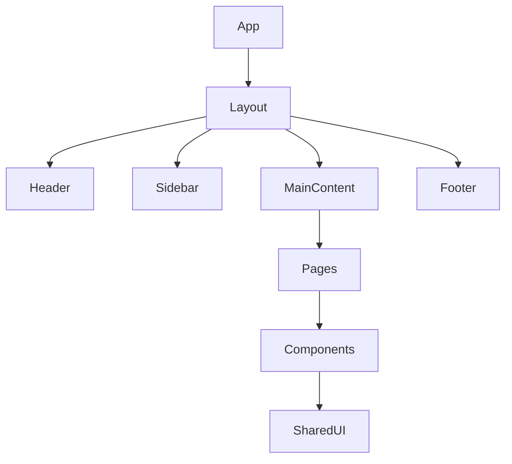
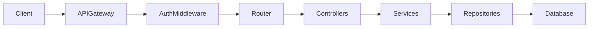
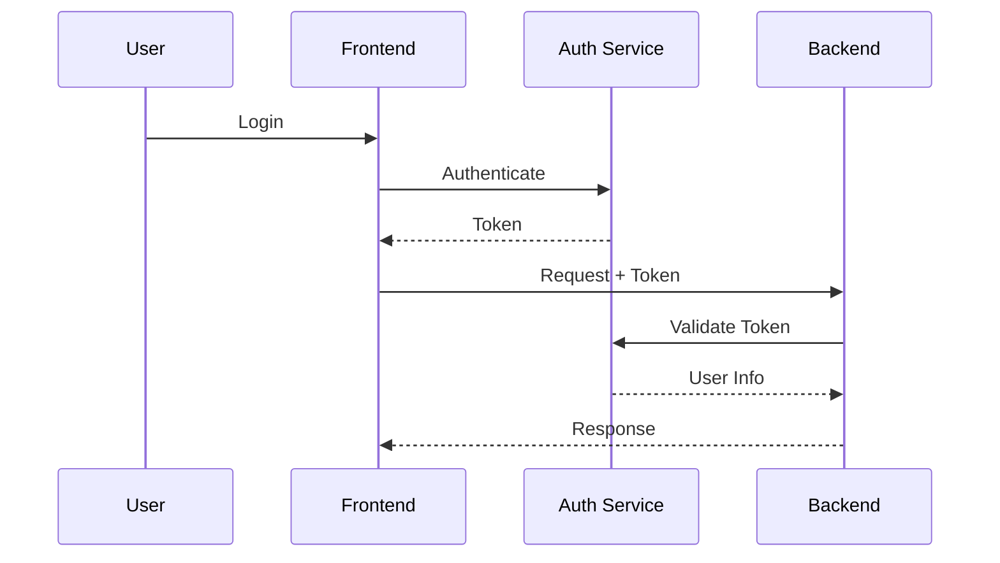
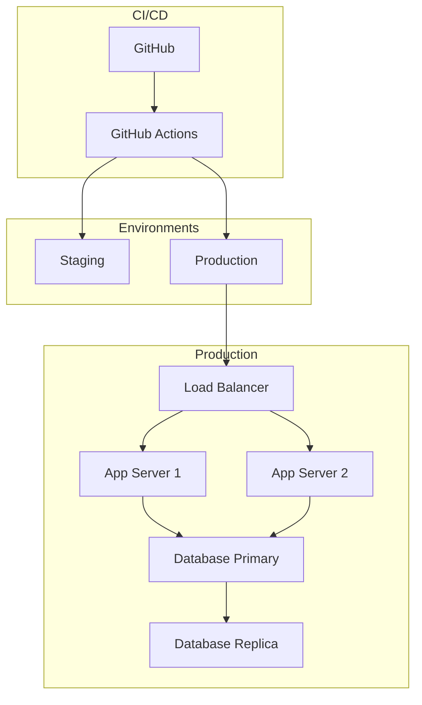

# Architecture Blueprint: {PROJECT_NAME}

> Generated on: {DATE}
> Version: 1.0

---

## 1. Executive Summary

{Brief description of the project, its goals, and target audience.}

---

## 2. Requirements Overview

### Functional Requirements
{List of core features and user stories.}

### Non-Functional Requirements
| Requirement | Target | Notes |
|-------------|--------|-------|
| Availability | {e.g., 99.9%} | |
| Response Time | {e.g., <200ms p95} | |
| Concurrent Users | {e.g., 10,000} | |
| Data Retention | {e.g., 7 years} | |
| Compliance | {e.g., GDPR, SOC 2} | |

### Constraints
{Budget, timeline, team size, existing systems, technology mandates.}

---

## 3. Architecture Overview

### Architecture Pattern
{Selected pattern and rationale.}

### High-Level Architecture Diagram

```mermaid
graph TB
    subgraph Client
        A[Web Browser]
        B[Mobile App]
    end
    subgraph Frontend
        C[{FRONTEND_FRAMEWORK}]
    end
    subgraph Backend
        D[API Gateway]
        E[{BACKEND_FRAMEWORK}]
    end
    subgraph Data
        F[{PRIMARY_DB}]
        G[{CACHE}]
    end
    A --> C
    B --> C
    C --> D
    D --> E
    E --> F
    E --> G
```

---

## 4. Tech Stack

### Selected Technologies

| Layer | Technology | Rationale |
|-------|-----------|-----------|
| Frontend Framework | | |
| CSS / Styling | | |
| State Management | | |
| Backend Framework | | |
| API Protocol | | |
| Primary Database | | |
| Cache Layer | | |
| Authentication | | |
| File Storage | | |
| Hosting | | |
| CI/CD | | |
| Monitoring | | |

### Alternatives Considered
{Brief comparison of alternatives evaluated for key decisions.}

---

## 5. Frontend Architecture

### Component Structure



### Routing Strategy
{Route structure and navigation patterns.}

### State Management Strategy
{How state is managed: server state, client state, form state.}

---

## 6. Backend Architecture

### API Design



### API Endpoints Overview
{Key endpoints grouped by domain.}

### Business Logic Layer
{Service layer patterns, domain models.}

---

## 7. Database Design

### Entity Relationship Diagram

```mermaid
erDiagram
    {ER_DIAGRAM_CONTENT}
```

### Data Access Patterns
{How data is queried, indexed, cached.}

### Migration Strategy
{How schema changes are managed.}

---

## 8. Authentication & Authorization

### Auth Flow



### Authorization Model
{RBAC/ABAC roles and permissions matrix.}

---

## 9. Security Measures

{Security decisions mapped to the security checklist. Reference specific items.}

---

## 10. DevOps & Deployment

### Deployment Architecture



### Environment Strategy
{Dev, staging, production setup.}

### CI/CD Pipeline
{Build, test, deploy steps.}

---

## 11. Project Structure

```
{PROJECT_NAME}/
├── {FOLDER_STRUCTURE}
```

---

## 12. Implementation Roadmap

### Phase 1: Foundation
{Core setup, auth, basic CRUD.}

### Phase 2: Core Features
{Primary feature set.}

### Phase 3: Polish & Scale
{Performance optimization, monitoring, advanced features.}

---

## 13. Risk Assessment

| Risk | Impact | Likelihood | Mitigation |
|------|--------|------------|------------|
| | | | |

---

## 14. Decision Log

| Decision | Options Considered | Chosen | Rationale |
|----------|-------------------|--------|-----------|
| | | | |
